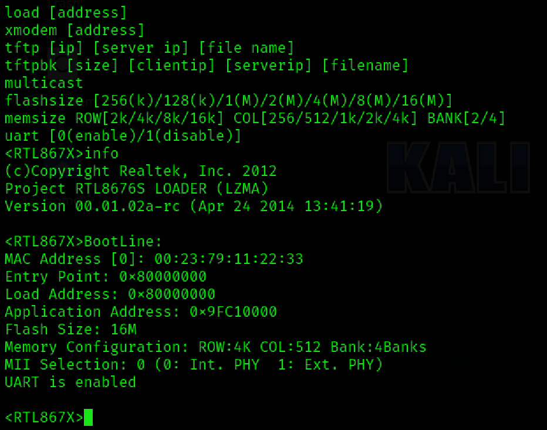
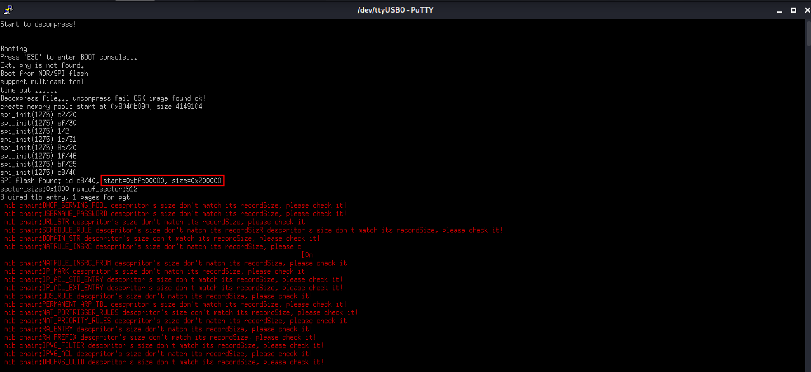
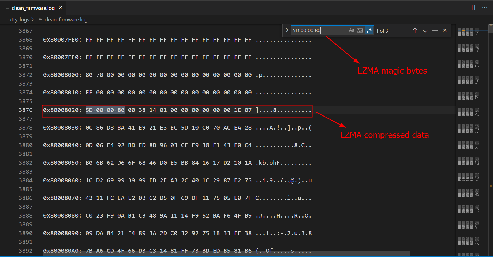

## Dumping firmware from bootloader
**I'd this doubt whether it is possible to dump firmware without using any of those devices such as bus pirate, bus blaster and jtagulator. Well, here it is 😜.**

Inorder to dump firmware from bootloader, we need to somehow have access to the bootloader. Well, you can get access to the bootloader by using `esc`, `delete`. 



Here, we are interested in `entry address: 0x80000000` and above we can see different commands and we have to use `d` to dump the firmware, you might have thought, how much should we dump? Well, you have to dump about `16M`. 

```sh
d 0x80000000 134217728
```

But this takes like 3-4 hrs to complete.

And the output looks something like this:
```sh
<RTL867X>d 0xbfc00000 2097152
0xBFC00000: 10 00 00 FF 00 00 00 00 10 00 01 05 00 00 00 00 ................

0xBFC00010: 00 00 00 00 00 00 00 00 10 00 FF F9 00 00 00 00 ................

0xBFC00020: 10 00 FF F7 00 00 00 00 10 00 FF F5 00 00 00 00 ................

0xBFC00030: 10 00 FF F3 00 00 00 00 10 00 FF F1 00 00 00 00 ................

0xBFC00040: 10 00 FF EF 00 00 00 00 10 00 FF ED 00 00 00 00 ................

0xBFC00050: 10 00 FF EB 00 00 00 00 10 00 FF E9 00 00 00 00 ................

0xBFC00060: 10 00 FF E7 00 00 00 00 10 00 FF E5 00 00 00 00 ................

0xBFC00070: 10 00 FF E3 00 00 00 00 10 00 FF E1 00 00 00 00 ................

0xBFC00080: 10 00 FF DF 00 00 00 00 10 00 FF DD 00 00 00 00 ................

0xBFC00090: 10 00 FF DB 00 00 00 00 10 00 FF D9 00 00 00 00 ................

0xBFC000A0: 10 00 FF D7 00 00 00 00 10 00 FF D5 00 00 00 00 ................

0xBFC000B0: 10 00 FF D3 00 00 00 00 10 00 FF D1 00 00 00 00 ................

0xBFC000C0: 10 00 FF CF 00 00 00 00 10 00 FF CD 00 00 00 00 ................

0xBFC000D0: 10 00 FF CB 00 00 00 00 10 00 FF C9 00 00 00 00 ................

0xBFC000E0: 10 00 FF C7 00 00 00 00 10 00 FF C5 00 00 00 00 ................

0xBFC000F0: 10 00 FF C3 00 00 00 00 10 00 FF C1 00 00 00 00 ................

0xBFC00100: 10 00 FF BF 00 00 00 00 10 00 FF BD 00 00 00 00 ................

0xBFC00110: 10 00 FF BB 00 00 00 00 10 00 FF B9 00 00 00 00 ................

0xBFC00120: 10 00 FF B7 00 00 00 00 10 00 FF B5 00 00 00 00 ................

0xBFC00130: 10 00 FF B3 00 00 00 00 10 00 FF B1 00 00 00 00 ................

0xBFC00140: 10 00 FF AF 00 00 00 00 10 00 FF AD 00 00 00 00 ................

0xBFC00150: 10 00 FF AB 00 00 00 00 10 00 FF A9 00 00 00 00 ................

0xBFC00160: 10 00 FF A7 00 00 00 00 10 00 FF A5 00 00 00 00 ................

0xBFC00170: 10 00 FF A3 00 00 00 00 10 00 FF A1 00 00 00 00 ................

0xBFC00180: 10 00 06 D0 24 1A 01 80 10 00 FF 9D 00 00 00 00 ....$...........

0xBFC00190: 10 00 FF 9B 00 00 00 00 10 00 FF 99 00 00 00 00 ................

0xBFC001A0: 10 00 FF 97 00 00 00 00 10 00 FF 95 00 00 00 00 ................

0xBFC001B0: 10 00 FF 93 00 00 00 00 10 00 FF 91 00 00 00 00 ................

0xBFC001C0: 10 00 FF 8F 00 00 00 00 10 00 FF 8D 00 00 00 00 ................

0xBFC001D0: 10 00 FF 8B 00 00 00 00 10 00 FF 89 00 00 00 00 ................

0xBFC001E0: 10 00 FF 87 00 00 00 00 10 00 FF 85 00 00 00 00 ................

0xBFC001F0: 10 00 FF 83 00 00 00 00 10 00 FF 81 00 00 00 00 ................

0xBFC00200: 10 00 FF 7F 00 00 00 00 10 00 FF 7D 00 00 00 00 ...........}....

0xBFC00210: 10 00 FF 7B 00 00 00 00 10 00 FF 79 00 00 00 00 ...{.......y....

0xBFC00220: 10 00 FF 77 00 00 00 00 10 00 FF 75 00 00 00 00 ...w.......u....

0xBFC00230: 10 00 FF 73 00 00 00 00 10 00 FF 71 00 00 00 00 ...s.......q....

0xBFC00240: 10 00 FF 6F 00 00 00 00 10 00 FF 6D 00 00 00 00 ...o.......m....

0xBFC00250: 10 00 FF 6B 00 00 00 00 10 00 FF 69 00 00 00 00 ...k.......i....

0xBFC00260: 10 00 FF 67 00 00 00 00 10 00 FF 65 00 00 00 00 ...g.......e....

0xBFC00270: 10 00 FF 63 00 00 00 00 10 00 FF 61 00 00 00 00 ...c.......a....

0xBFC00280: 10 00 FF 5F 00 00 00 00 10 00 FF 5D 00 00 00 00 ..._.......]....

0xBFC00290: 10 00 FF 5B 00 00 00 00 10 00 FF 59 00 00 00 00 ...[.......Y....

0xBFC002A0: 10 00 FF 57 00 00 00 00 10 00 FF 55 00 00 00 00 ...W.......U....

0xBFC002B0: 10 00 FF 53 00 00 00 00 10 00 FF 51 00 00 00 00 ...S.......Q....

0xBFC002C0: 10 00 FF 4F 00 00 00 00 10 00 FF 4D 00 00 00 00 ...O.......M....

0xBFC002D0: 10 00 FF 4B 00 00 00 00 10 00 FF 49 00 00 00 00 ...K.......I....

0xBFC002E0: 10 00 FF 47 00 00 00 00 10 00 FF 45 00 00 00 00 ...G.......E....

0xBFC002F0: 10 00 FF 43 00 00 00 00 10 00 FF 41 00 00 00 00 ...C.......A....

0xBFC00300: 10 00 FF 3F 00 00 00 00 10 00 FF 3D 00 00 00 00 ...?.......=....

0xBFC00310: 10 00 FF 3B 00 00 00 00 10 00 FF 39 00 00 00 00 ...;.......9....

0xBFC00320: 10 00 FF 37 00 00 00 00 10 00 FF 35 00 00 00 00 ...7.......5....

0xBFC00330: 10 00 FF 33 00 00 00 00 10 00 FF 31 00 00 00 00 ...3.......1....

0xBFC00340: 10 00 FF 2F 00 00 00 00 10 00 FF 2D 00 00 00 00 .../.......-....

0xBFC00350: 10 00 FF 2B 00 00 00 00 10 00 FF 29 00 00 00 00 ...+.......)....

0xBFC00360: 10 00 FF 27 00 00 00 00 10 00 FF 25 00 00 00 00 ...'............

0xBFC00370: 10 00 FF 23 00 00 00 00 10 00 FF 21 00 00 00 00 ...#.......!....

0xBFC00380: 10 00 FF 1F 00 00 00 00 10 00 FF 1D 00 00 00 00 ................

0xBFC00390: 10 00 FF 1B 00 00 00 00 10 00 FF 19 00 00 00 00 ................

0xBFC003A0: 10 00 FF 17 00 00 00 00 10 00 FF 15 00 00 00 00 ................

0xBFC003B0: 10 00 FF 13 00 00 00 00 10 00 FF 11 00 00 00 00 ................

0xBFC003C0: 10 00 FF 0F 00 00 00 00 10 00 FF 0D 00 00 00 00 ................

0xBFC003D0: 10 00 FF 0B 00 00 00 00 10 00 FF 09 00 00 00 00 ................
```

Incase you are confused about the address, its where the `SPI flash` is.

Here is the video how it actually looks like. 


`WE ARE IN THE MATRIX`



But some hex bytes will not be proper, I mean **non-printable** characters and sometimes the hex bytes do get missed out, which is shown below. In such case, you need to dump that specific address individually. `d 0xBFC00580 15`, this will remediate the issue.

```sh

0xBFC00580: 35 29 02 00 3C 08 77 00 35  0 D $....)....... ..
```

So this will cause issue while we extract the firmware using `binwalk`. But I've a python script by which it displays all the addresses it has missed out and all the non-printable characters. So you can do it manually. You can pipe this output to some file.

I've created a bash script even to extract the `hex bytes` and convert that to `raw bytes` and extract the firmware using `binwalk`.

But from which address to extract?

Well, the firmware uses a compression algorithm called `LZMA`, so you need to search for its **magic bytes**, which is `5D 00 00 80`.



You might even ask, until which address. Well, it depends. Usually you need to stop when you see alot of null bytes but still might not be sure because there is a lot of room of null bytes which is shown below.


