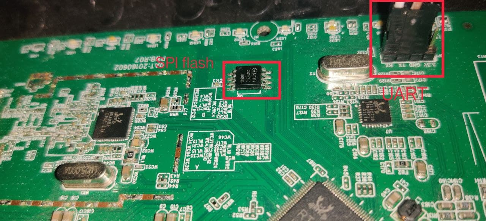

## Dumping firmware from SPI Flash or using JTAG Interface

This method is very popular in dumping firmware from an IOT device. For this, we need to locate where the `SPI flash` is. Usually, it is present nearby to UART serial port or processor.

We need to have few components inorder to do this:
* [Buspirate](https://www.sparkfun.com/products/12942)
* [JMT-SM2 wire connector](https://www.aliexpress.com/item/4000699101760.html)
* [Micro USB](https://www.amazon.com/AmazonBasics-Male-Micro-Cable-Black/dp/B0711PVX6Z/ref=sr_1_5?keywords=micro+usb+cable&qid=1641318982&sr=8-5)

You can use [`flashrom`](https://www.flashrom.org/Flashrom) to dump the firmware for SPI Flash or use [`bus blaster`](http://dangerousprototypes.com/docs/Bus_Blaster) or [`jtagulator`](http://www.grandideastudio.com/jtagulator/) for `JTAG` interface and you can also use `jtagulator` to dump from `UART` interface too, which is pretty interesting.

This is a pretty popular method and I'm not going to discuss much about this as there are many articles regarding this.
