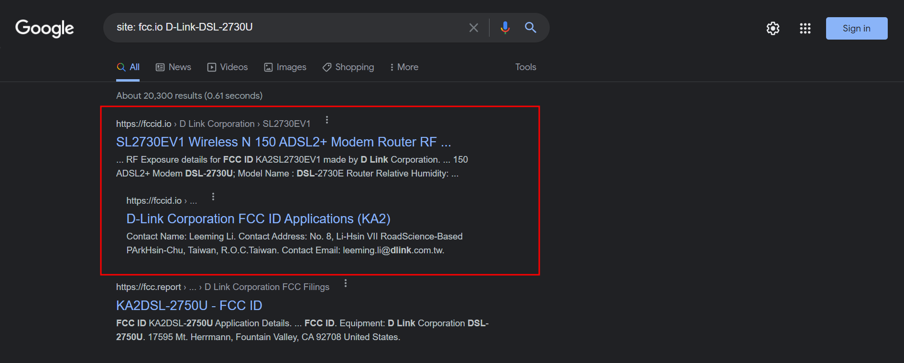

One of my old routers was lying at my home. So, I decided to reverse engineer it and extract the firmware out of it. There are 3 ways by which we can do this.

So without further do, Let's dive in ;)

## Router Specifications
* Model : [`D-Link-DSL-2730U`](https://www.dlink.com/en/products/dsl-2730u-wireless-n150-adsl2-router)

## Information Gathering
Whenever you decide to attack some IOT device, we need to gather as much information as possible, from both hardware and software perspective. As the saying goes, `Better the enumeration, so are vulnerabilities`.

When it comes to hardware, we need to take a look at its [`FCC ID`](https://fccid.io/KA2SL2730EV1/RF-Exposure-Info/RF-Exposure-2294482), which describes each and every aspect and specification of that particular thing. Usually found on back of your device. FYI, every wireless communication device in US must have `FCC ID`. If you are from other country, try using google dorks such as `site:fcc.io "{your device}"`. For example, `site: fcc.io D-Link-DSL-2730U`.

After which, you need to crack open the router, to see if there is some sort of juicy info such as finding UART, JTAG serial port. In my case, I found UART interface.

![[find_uart.jpg]]

Not every device looks like this, sometimes the pins are not soldered to the PCB or even though its soldered, the circuit might not be connected or more specifically its in **open loop** configuration. So, it varies according to the situation.

* If the pins are not soldered, you can solder it using a basic soldering gun kit
* Incase, the pins are not connected to circuit, just take a male pin and connect that to the circuit to make it a **closed loop** configuration

Sometimes, UART is disabled. For which you need to enter to bootloader inorder to enable it. Use `esc` or `delete` to enter to bootloader.

![[2021-10-11_17-50.png]]

FYI, always pay attention to the serial output when doing this. As it will contain a lot of juicy info. More importantly, look up words such as **partitions** and **sectors**, this will be very useful when dumping firmware.

I shall show you how to connect to UART interface via your PC in the next slide.
