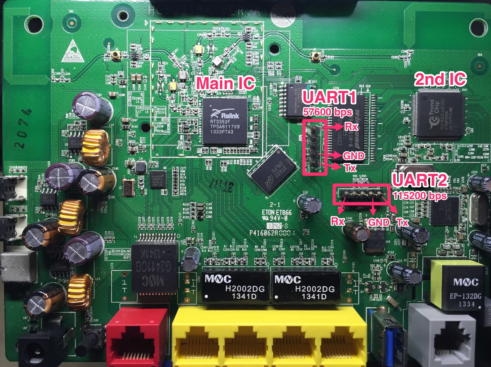
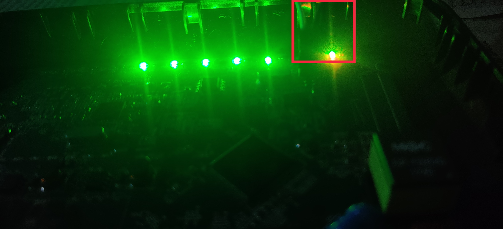
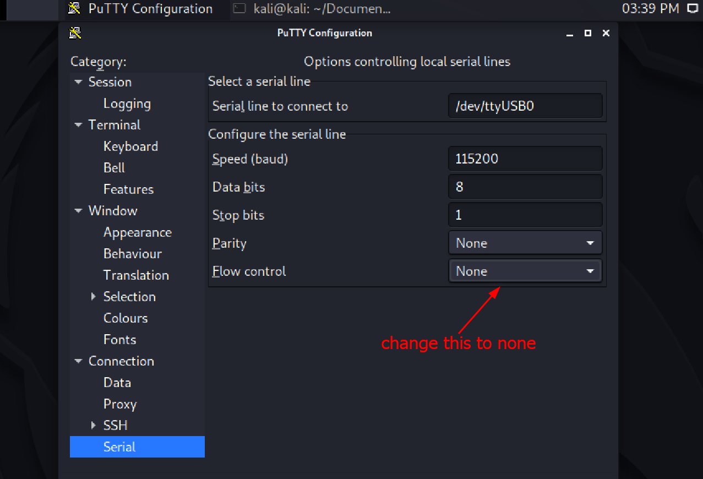
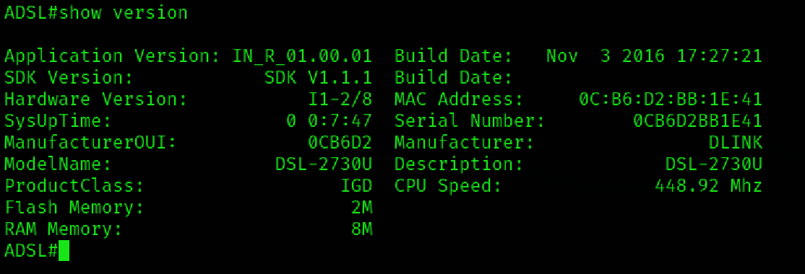

### UART Identification

* UART is a serial communication interface by which chips or microcontrollers communicate with each other
* We can identify UART interface by just having a look at the pins mainly **Rx**, **Tx**, **Gnd**, **Vcc**, not necessarily in that order, we can identify this using `multimeter`. Sometimes, if lucky enough these pins will be labelled on the PCB board. For me, that was the case.

Once you have identified the interface, you need to use a [`usb to ttl converter`](https://www.amazon.com/IZOKEE-CP2102-Converter-Adapter-Downloader/dp/B07D6LLX19/ref=sr_1_4?keywords=usb+to+ttl+converter&qid=1637327862&qsid=137-0702924-7531052&sr=8-4&sres=B07BBPX8B8%2CB07D6LLX19%2CB00LODGRV8%2CB00LZV1G6K%2CB07WX2DSVB%2CB07D9R5JFK%2CB00IJXZQ7C%2CB07RBKCW3S%2CB07XF2SLQ1%2CB07F5FPQH5%2CB072K3Z3TL%2CB07R8BQYW1%2CB078W5L8W1%2CB01N47LXRA%2CB06ZYPLFNB%2CB0912KK1T5&srpt=ELECTRONIC_ADAPTER) to interact with the router.

After which we need to determine its `baud rate`, we can determine it using:

* Trial and error of standard values such as `[110, 300, 600, 1200, 1800, 2400, 3600, 4300, 4800, 7200, 9600, 14400, 19200, 28800, 38400, 39400, 57600, 115200, 128000, 230400, 256000]`
* Take a sample using `Saleae Logic` and use `baud-estimate` extension or try using the above values until you get a readable output

When I determined the baud rate it was **115200**. You can interact it using `puTTY`, `minicom` and `screen`. I've used `puTTY`.  

Well, if you have reached till here. Congratulations 🎉, you will be prompted with a boot console 💻.

We have access to bootloader in our case. But sometimes if lucky, you might directly be able to interact with OS, possible in old routers. Let's see about that in the next part of this slide.
